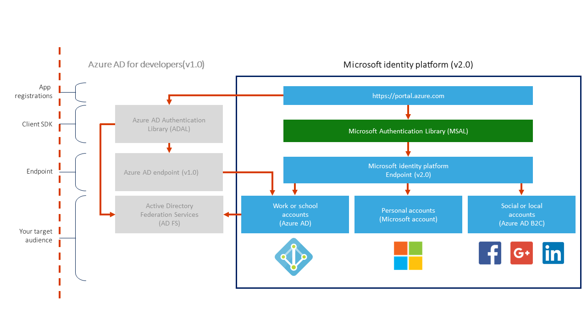

% Getting started with the Microsoft Identity Platform using .NET
% Sidney Andrews
% December 10, 2019

# Goals

## Three goals


## Agenda (questions)

- What is the Microsoft Identity Platform?
- How do we authenticate manually?
- How can the MSAL help us authenticate?
- How do we access the graph once we are authenticated?
- Are there SDKs for the graph?

# Microsoft Identity Platform

## Identity as a control plane


## Azure Active Directory


## Active Directory Authentication Library


## Microsoft Identity Platform 

**<https://docs.microsoft.com/azure/active-directory/develop/>**

Unified full-stack development tools to work with *all Microsoft identities*.

## Microsoft Identity Platform



# Demo: *Microsoft Identity Platform documentation*

::: notes
https://docs.microsoft.com/azure/active-directory/develop/
:::

# Authenticating to Microsoft

## AAD Applications

- Register applications with AAD to get access to authentication and tokens
- Usually include a redirect URI for the application
- Registration will yield client credentials required to authenticate
- Can register different types of applications

## Application Types


## Authentication flows

| Flow | Description |
| --- | --- |
| Authorization code | Native and web apps securely obtain tokens in the name of the user |
| Client credentials | Service applications run without user interaction |
| On-behalf-of | The application calls a service/web API, which in turns calls Microsoft Graph |
| Implicit | Used in browser-based applications |
| Device code | Enables sign-in to a device by using another device that has a browser |
| Integrated Windows | Windows computers silently acquire an access token when they are domain joined |
| Interactive | Mobile and desktops applications call Microsoft Graph in the name of a user |
| Username/password | The application signs in a user by using their username and password | |

## Login URL

-   One base URL for all login and token queries:
    -   **https://login.microsoftonline.com/tenant_id/oauth2/v2.0**
    -   ***Note**: Replace tenant_id with your AAD tenant's unique identifier*
-   Relative URLs for specific actions:
    -   **login**: \/authorize
    -   **acquire token**: \/token

## Interactive authentication

1.  Navigate to the **\/authorize** endpoint for **login.microsoftonline.com**
    1.  Provide appropriate query string parameters
1.  Login using the interface you already know!
1.  Observe the response
    1.  Will include a unique code that can be used to acquire a token
    1.  Also includes a state parameter

## Login Query String and URI Parameters

| Parameter | Description |
| --- | --- |
| ``tenant_id`` | AAD tenant unique identifier |
| ``client_id`` | AAD application unique identifier |
| ``response_type`` | Usually ``code`` |
| ``redirect_uri`` | Where to go after authentication |
| ``response_mode`` | Usually ``query`` but can be ``form_post`` |
| ``scope`` | What permissions are required |
| ``state`` (optional) | Value that can be used to validate response |

# Demo: *Manually acquiring a token from Microsoft*

::: notes
https://docs.microsoft.com/graph/auth-v2-user
:::

# Microsoft Authentication Library (MSAL)

## MSAL SDK

**<https://docs.microsoft.com/azure/active-directory/develop/msal-overview>**

-   Consistent single library for authentication with *all Microsoft identities*
-   Can be used to access:
    -   Microsoft Graph
    -   other Microsoft APIs
    -   third-party Web APIs
    -   your own APIs
-   Available in various programming languages and platforms:
    -   .NET
    -   JavaScript
    -   Python
    -   Java
    -   Android/iOS

## NuGet

-   Available on NuGet
    -   **Microsoft.Identity.Client**

## Provider model

-   **Public client applications**
    -   Applications always sign-in users
    -   Uses the MSAL ``PublicClientApplication`` class
    -   Examples:
        -   Desktop apps calling web APIs on behalf of the signed-in user
        -   Mobile apps
        -   Apps running on devices that don't have a browser, like those running on iOT
-   **Confidential client applications**
    -   Applications may sign-in automatically
    -   Uses the MSAL ``ConfidentialClientApplication`` class
    -   Examples:
        -   Web apps calling a web API
        -   Web APIs calling a web API
        -   Daemon apps, even when implemented as a console service like a Linux daemon or a Windows service 

## Builder model

```csharp
var clientApp = PublicClientApplicationBuilder.Create(client_id)
    .Build();
```

## Authority modifier

```csharp
var clientApp = PublicClientApplicationBuilder.Create(client_id)
    .WithAuthority(AzureCloudInstance.AzurePublic, tenant_id)
    .Build();
```

## Redirect URI modifier

```csharp
var clientApp = PublicClientApplicationBuilder.Create(client_id)
    .WithAuthority(AzureCloudInstance.AzurePublic, tenant_id)
    .WithRedirectUri("http://localhost")
    .Build();
```

## Acquring a token interactively

```csharp
string[] scopes = { "user.read" };

var authResult = await clientApp
    .AcquireTokenInteractive(scopes)
    .ExecuteAsync();

string token = authResult.AccessToken;
```

# Demo: *Interactive authentication using MSAL.NET* 

::: notes
https://docs.microsoft.com/azure/active-directory/develop/quickstart-v2-windows-desktop
:::

## Public client application provider implementations

| Flow | Provider | Method |
| --- | --- | --- |
| Interactive | ``PublicClientApplication`` | ``AcquireTokenInteractive()`` |
| Device code | ``PublicClientApplication`` | ``AcquireTokenWithDeviceCode()`` |
| Silent | ``PublicClientApplication`` | ``AcquireTokenSilent()`` | 
| Integrated Windows | ``PublicClientApplication`` | ``AcquireTokenByIntegratedWindowsAuth()`` |
| Username/password | ``PublicClientApplication`` | ``AcquireTokenByUsernamePassword()`` |

## Confidential client application provider implementations

| Flow | Provider | Method |
| --- | --- | --- |
| Authorization code | ``ConfidentialClientApplication`` | ``AcquireTokenByAuthorizationCode()`` |
| Client credentials | ``ConfidentialClientApplication`` | ``AcquireTokenForClient()`` | 
| On-behalf-of | ``ConfidentialClientApplication`` | ``AcquireTokenOnBehalf()`` | 

## Acquring a token using a device code

```csharp
string[] scopes = { "user.read" };

var authResult = await clientApp
	.AcquireTokenWithDeviceCode(scopes, async prompt =>
	{
		await Console.Out.WriteLineAsync(prompt.Message);
	})
	.ExecuteAsync();

string token = authResult.AccessToken;
```

# Demo: *Device Code authentication using MSAL.NET*

::: notes
https://docs.microsoft.com/azure/active-directory/develop/scenario-desktop-acquire-token?tabs=dotnet#command-line-tool-without-web-browser
:::

# Microsoft Graph

## Microsoft Graph


## Microsoft Graph REST API

-   One base URL for all queries:
    -   Structure
        -   **https://graph.microsoft.com/{version}/{resource}?{query-parameters}**
    -   Basic API
        -   **https://graph.microsoft.com/v1.0/**
    -   Beta API
        -   **https://graph.microsoft.com/beta/**
-   Relative resource URLs (not all inclusive):
    -   \/me
        -   \/me\/messages
        -   \/me\/drive
    -   \/user
    -   \/group
    -   \/drive
    -   \/site

## Calling the REST API

```csharp
var httpClient = new HttpClient();

httpClient.DefaultRequestHeaders.Authorization = new AuthenticationHeaderValue("Bearer", token);

string url = "https://graph.microsoft.com/v1.0/me";

string response = await httpClient.GetStringAsync(url);
```

## Calling the REST API using Flurl.HTTP

```csharp
string response = await "https://graph.microsoft.com/v1.0/me"
    .WithOAuthBearerToken(token)
    .GetStringAsync();
```

# Demo: *Issuing a simple HTTP request to the Microsoft Graph*

::: notes
https://docs.microsoft.com/azure/active-directory/develop/scenario-desktop-call-api?tabs=dotnet#calling-a-web-api
:::

## Microsoft Graph Explorer

**<https://developer.microsoft.com/graph/graph-explorer>**

Tool that lets you make requests against the Microsoft Graph

# Demo: *Testing various queries using the Microsoft Graph Explorer*

::: notes
https://developer.microsoft.com/graph/graph-explorer
https://developer.microsoft.com/graph/examples
:::

# Microsoft Graph SDKs

## Microsoft Graph SDK

-   SDK to interact with the Microsoft Graph using easy-to-parse classes and properties
-   Available on NuGet
    -   **Microsoft.Graph**
    -   **Microsoft.Graph.Auth**

## Microsoft Graph interactive authentication

```csharp
InteractiveAuthenticationProvider provider = new InteractiveAuthenticationProvider(
    clientApp, 
    scopes
);

GraphServiceClient client = new GraphServiceClient(provider);
```

## Microsoft Graph device code authentication

```csharp
DeviceCodeProvider provider = new DeviceCodeProvider(
    clientApp, 
    scopes
);

GraphServiceClient client = new GraphServiceClient(provider);
```

## Example of a Graph SDK query

```csharp
User me = await client.Me
    .Request()
    .GetAsync();
```

## More complex example

```csharp
IUserMessagesCollectionPage messages = await client.Me.Messages
    .Request()
    .Select(m => new
    {
        m.Subject,
        m.Sender
    })
    .OrderBy("receivedDateTime")
    .GetAsync();
```

# Demo: *Issuing a request using the Microsoft Graph SDK for .NET*

::: notes
https://docs.microsoft.com/graph/sdks/create-client?tabs=CS
https://docs.microsoft.com/graph/sdks/create-requests?tabs=CS
:::

# Review

## Review (public client application builder)

```csharp
var clientApp = PublicClientApplicationBuilder.Create(client_id)
	.WithAuthority(AzureCloudInstance.AzurePublic, tenant_id)
	.WithRedirectUri("http://localhost")
	.Build();
```

## Review (interactive authentication provider)

```csharp
string[] scopes = { "user.read", "mail.read" };

InteractiveAuthenticationProvider provider = new InteractiveAuthenticationProvider(
	clientApp,
	scopes
);
```

## Review (graph client)

```csharp
GraphServiceClient client = new GraphServiceClient(provider);

User me = await client.Me.Request().GetAsync();

IUserMessagesCollectionPage messages = await client.Me.Messages
	.Request()
	.Select(m => new
	{
		m.Subject,
		m.Sender
	})
	.OrderBy("receivedDateTime")
	.GetAsync();
```

## Learn more

| Link |
| --- |
| https://docs.microsoft.com/azure/active-directory/develop/ |
| https://docs.microsoft.com/graph/auth-v2-user |
| https://docs.microsoft.com/azure/active-directory/develop/quickstart-v2-windows-desktop |
| https://docs.microsoft.com/azure/active-directory/develop/scenario-desktop-acquire-token?tabs=dotnet#command-line-tool-without-web-browser |
| https://docs.microsoft.com/azure/active-directory/develop/scenario-desktop-call-api?tabs=dotnet#calling-a-web-api |
| https://developer.microsoft.com/graph/graph-explorer |
| https://developer.microsoft.com/graph/examples |
| https://docs.microsoft.com/graph/sdks/create-client?tabs=CS |
| https://docs.microsoft.com/graph/sdks/create-requests?tabs=CS |

# Thank you!
